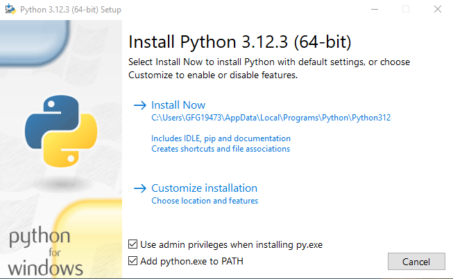

# Mavenir Rag

Mavenir Rag is a FastAPI-based RAG service for:

- ingesting corpus documents (PDF/DOCX),
- storing embeddings in Milvus with metadata,
- storing source artifacts/pages/images in MinIO,
- running similarity search against the indexed corpus, and
- generating LLM-based questions from matched content.

## 1. Tech Stack

- Python 3.13+
- FastAPI + Uvicorn
- LiteLLM (chat + embeddings; supports Ollama/OpenAI/Gemini)
- Milvus (vector database)
- MinIO (object storage)
- Poetry (dependency + script management)

## 2. Project Structure

- `api/` - FastAPI app, routers, clients, and RAG utilities
- `tests/` - unit/integration-style tests for clients
- `docker-compose.yml` - local Milvus + MinIO + etcd stack
- `Dockerfile` - API container build
- `.env.example` - environment variable template

## 3. Prerequisites

- Python `3.13.x`
- Poetry `2.x`
- Docker + Docker Compose
- Ollama installed locally (if using default Ollama provider)

### 1. Install Python

The implementation was done on **Python 3.13.5**.

#### Windows

1.  Run [Python Installer](https://www.python.org/downloads/)
2.  Make sure to mark Add Python to PATH otherwise you will have to do it explicitly. It will start installing Python on Windows.
    

3.  After installation close the installer and to verify the installation enter the following commands in your Terminal app

```shell
python3 --version
```

#### Linux

1.  You will find Python already installed. You can check it using the following command from the terminal.

```shell
  python --version
```

2.  To check the latest version of Python 3.x.x :

```shell
  python3 --version
```

#### MacOS

1. To install Python simply open the Terminal app from Application -> Utilities and enter the following command.

```shell
 brew install python3
```

2. To verify the installation enter the following commands in your Terminal app

```shell
 python3 --version
```

### 2. Install Poetry

Follow the official installation [guide](https://python-poetry.org/docs/) to install Poetry.

> **Note:** Install **Poetry (version 2.1.3)**. Using older versions of Poetry may cause compatibility issues with this project.

## 4. Setup

1. Install dependencies:

```bash
poetry install
```

2. Configure environment:

```bash
cp .env.example .env
```

Then update `.env` values for your machine. In this repo's local Docker setup:

- Milvus host port is mapped to `19531` (`MILVUS__PORT=19531`)
- MinIO S3 API is mapped to `9002` (`MINIO__ENDPOINT=localhost:9002`)
- MinIO console is exposed on `9003`

## 5. Run Locally

Start backing services (Milvus + MinIO + Ollama models):

```bash
poetry run setup:all
```

Or start individually:

```bash
poetry run setup:milvus-minio
poetry run setup:ollama
```

Start API server:

```bash
poetry run start
```

The API runs on `http://localhost:8001` and docs are available at:

- `http://localhost:8001/docs`
- `http://localhost:8001/redoc`

## 6. Stop Services

```bash
poetry run stop:all
```

Or individually:

```bash
poetry run stop:ollama
poetry run stop:milvus-minio
```

To stop all services **and permanently delete all persisted data** (Milvus collections, MinIO buckets, etcd state, Redis data):

```bash
poetry run clear:data
```

> **Warning:** This is irreversible. All ingested documents, embeddings, and stored objects will be lost.

## 7. Poetry Scripts

- `poetry run start` - run API with reload
- `poetry run serve` - run API without reload
- `poetry run test` - run tests + coverage
- `poetry run setup:ollama`
- `poetry run setup:milvus-minio`
- `poetry run setup:all`
- `poetry run stop:ollama`
- `poetry run stop:milvus-minio`
- `poetry run stop:all`
- `poetry run clear:data` — stop all services and delete all persisted volume data

## 8. API Overview

### i) Corpus Routes (`/corpus`)

- `POST /corpus/document/upload` - upload files to MinIO
- `GET /corpus/document/list-corpus` - list uploaded corpus docs
- `GET /corpus/document/{doc_id}/download?topic=...` - download corpus document
- `POST /corpus/document/ingest-doc-ids` - ingest uploaded docs into Milvus
- `POST /corpus/document/ingest-file` - upload + ingest single file
- `POST /corpus/document/ingest-files` - upload + ingest multiple files
- `DELETE /corpus/document/delete` - delete docs from MinIO + Milvus
- `GET /corpus/document/{doc_id}/images?topic=...` - list extracted images
- `GET /corpus/document/{doc_id}/images/download?topic=...` - download image

### ii) Matcher Routes (`/mavenir-rag`)

- `POST /mavenir-rag/document/infer`
  - inputs include: `topic`, `input_queries`, `limit`, `group_size`,
    `question_answer_type`, `knowledge_feed_mode`
  - returns ranked matches + generated questions + markdown report URL

## 9. Ingestion and Matching Flow

1. Upload corpus files to MinIO under `corpus/<topic>/<doc_id>/...`
2. Parse and chunk documents (with page/image metadata)
3. Generate embeddings via LiteLLM
4. Insert chunk vectors + metadata into Milvus
5. For inference, embed input queries and search Milvus with topic filter
6. Aggregate chunk matches into document-level compatibility scores
7. Generate LLM question sets from top chunks (text/image/hybrid feed)
8. Publish markdown report to MinIO and return a presigned URL

## 10. Document Parsing Strategy

The ingestion pipeline uses `pymupdf4llm` + a custom `MarkdownParser` to preserve document structure while making image-heavy pages LLM-friendly.

### i) PDF to page-wise markdown (`pymupdf4llm`)

Each PDF is converted into markdown with:

- `page_chunks=True` to keep output page-by-page
- `write_images=True` to extract inline images referenced in markdown

This gives a list of markdown page objects, each with:

- page metadata (`metadata.page`)
- page markdown text (`text`)

### ii) Store full PDF pages as images in MinIO

In parallel with markdown generation, each PDF page is rendered to PNG using `pymupdf` (`page.get_pixmap()`), then uploaded to MinIO under:

- `pdf_pages/<topic>/<doc_id>/page_<n>.png`

A page-to-object mapping is maintained so each later chunk can reference its source page image.

### iii) Replace extracted markdown image tags with textual descriptions

For each markdown page, image placeholders like:

- ``

are processed one by one:

1. extracted image is uploaded to MinIO under `parsed_images/<topic>/<doc_id>/...`
2. a presigned URL is generated
3. the LLM is asked to describe the image
4. the markdown image tag is replaced with an `Image Description` block

This happens page-by-page, and an in-memory cache avoids regenerating descriptions for duplicate image paths.

**Filtering out non-meaningful images**

Not every image in a PDF is worth describing. Two filters guard against wasted LLM calls:

- **Size filter (`_is_meaningful_image()`):** images smaller than 150×150 px are skipped entirely. This catches icons, decorative sprites, and tiny data blobs that would produce useless descriptions.
- **Content filter (`_is_valid_description()`):** for images that pass the size check, the LLM prompt instructs the model to respond with exactly `SKIP` if the image contains no meaningful content (e.g. binary/hex blobs that are large but content-free). The response is validated before the description is embedded.

> **Trade-off:** The `SKIP` check still costs one LLM vision inference call per garbage image that passes the size filter. A heuristic pre-filter (e.g. image entropy or aspect ratio analysis) could eliminate those calls entirely, but adds parsing complexity.

**Images and tables in chatbot answers**

No special handling is needed for chatbot Q&A. Ingested chunks already contain image descriptions (injected during step 4 above) and table markdown (preserved as-is by the `MarkdownParser`). Because the RAG context is built directly from these chunks, the chatbot can answer questions about images and tables automatically.

### iv) Chunking strategy (`api/utils/markdown_parser.py`)

After image replacement, markdown pages are chunked with these rules:

- **Header-aware splitting:** split by markdown headings (`#` to `######`) using a single pass.
- **Parent heading breadcrumb:** each chunk stores ordered heading ancestry in `parent_headings`.
- **Optional header injection:** when enabled, heading text is included in chunk content.
- **Page preservation:** chunking is done per page (`chunk_pdf_pages`), and each chunk carries `page_num`.
- **Token-safe chunking:** oversized chunks are split by token count (`tiktoken`) using paragraph/code-block aware boundaries, capped by `DOC_PARSER__CHUNK_MAX_TOKENS`.

Result: chunks remain structurally meaningful (section context + page linkage), while still fitting embedding/model token limits.

## 11. Inference Strategy

Inference is exposed through `POST /mavenir-rag/document/infer` in `api/routers/matcher_router.py`, which orchestrates semantic matching + LLM enrichment + report generation.

### i) Request handling at matcher router

The endpoint accepts:

- `input_queries: list[str]` - one or more query texts to search against corpus chunks
- `topic: TopicEnum` - mandatory topic filter for corpus search
- `knowledge_feed_mode: text | image | hybrid`
- `question_answer_type: subjective | one_word | mcq | match_making`
- `limit` - number of top documents to retrieve
- `group_size` - number of top chunks per matched document
- `questions_per_top_chunks` - number of generated questions per chunk

The router forwards these to `rag_inference_pipeline(...)`.

### ii) Query embedding and Milvus search (hybrid dense + BM25)

Inside `rag_inference_pipeline`:

1. every input query is embedded using `llm_client.embed(...)`
2. both the dense vector **and the raw query text** are passed to `milvus_client.search(query_vectors=[...], query_texts=[...])`
3. Milvus fuses dense-vector similarity with BM25 sparse retrieval internally before returning ranked hits
4. search is filtered by topic using:
   - `expr=f'topic == "{topic.value}"'`

This ensures results are matched only within the selected topic namespace.

**Assumption:** Milvus collection has a sparse BM25 index enabled alongside the dense COSINE index. If only a dense index exists, `query_texts` is silently ignored and retrieval degrades to dense-only with no error.

**Limitations and trade-offs:**

| # | Limitation | Impact |
|---|-----------|--------|
| 1 | **BM25 requires a sparse index at collection creation time.** If the collection was created before this change, it has no sparse field and hybrid search silently falls back to dense-only. | Existing collections must be re-created and all documents re-ingested to benefit from BM25. There is no in-place migration path. |
| 2 | **Fusion weight is not tunable via API.** The relative weight between dense and BM25 scores is fixed at the Milvus layer. | Queries that are highly lexical (e.g., exact acronyms, codes) vs. highly semantic cannot be tuned at request time without changing server-side Milvus configuration. |
| 3 | **BM25 is language-agnostic but stemming-unaware.** Milvus built-in BM25 tokenises on whitespace and does not stem or lemmatise terms. | "embedding" and "embeddings" are treated as different tokens. Dense retrieval compensates partially, but purely lexical matches on morphological variants may be missed. |

### iii) Ranking and document-level scoring

Raw Milvus chunk hits are converted into ranked document matches by `generate_doc_match_report(...)`, which:

- groups chunk hits by `doc_id`
- computes document compatibility from retrieved chunk scores
- preserves chunk-level metadata (chunk text, page number, page image object id)
- returns per-query summary + detailed matches

### iv) Knowledge-feed mode for question generation

After ranking, `generate_questions_from_chunks(...)` enriches each matched chunk with LLM-generated questions.

The prompt template is selected by `question_answer_type` (subjective, MCQ, match-making, one-word).

**Current behaviour (simplified):** All three `knowledge_feed_mode` values — `text`, `image`, and `hybrid` — execute the same code path. Only the chunk text is sent to the LLM. The separate `image` and `hybrid` branches (which previously appended presigned PDF page image URLs to the prompt) have been removed.

**Why it was simplified:** The old code sent image URLs as plain text in the prompt — the LLM never actually saw the images. Since it wasn't working, the image and hybrid paths were removed to avoid giving the impression that image-based question generation was functional.

**Assumption:** The API still accepts `image` and `hybrid` as valid values for `knowledge_feed_mode`, but all three modes currently behave the same way — questions are always generated from text only.

**Limitations and trade-offs:**

| # | Limitation | Impact |
|---|-----------|--------|
| 1 | **`image` and `hybrid` modes are accepted but do nothing different.** | Users selecting these modes get text-only output with no warning. The option appears to work but doesn't. |
| 2 | **Image-based question generation is not yet implemented.** It requires a vision-capable LLM and sending images as proper multimodal inputs, not just URLs in text. | Documents heavy on diagrams, charts, or schematics are only understood through their extracted text, which may miss visual context. |
| 3 | **Page image links are no longer included in the response.** Removing the image path eliminated the extra MinIO lookups that fetched per-page image URLs. | Fewer network calls means faster responses, but page-level image links are no longer available to downstream consumers. |

### v) Markdown report generation

At the end of inference, the pipeline calls `generate_markdown_report(...)` and stores a report in MinIO.  
The final API response includes:

- `results` - enriched match output
- `markdown_report_url` - downloadable/shareable report link

## 12. Background Task Processing

See [docs/background-task-processing.md](docs/background-task-processing.md) for endpoints, configuration, and the full breakdown of assumptions and limitations around threading, Redis, and concurrency.

## 13. File Handling — Assumptions and Limitations

See [docs/file-handling.md](docs/file-handling.md) for the full breakdown of assumptions, memory/disk limitations, and possible optimizations.

## 14. Testing

Run the unit test suite:

```bash
poetry run test
```

Coverage HTML output is generated in `python_coverage/`.

### E2E Integration Test

The E2E test drives the full RAG pipeline against a live API:
**Ingest → Poll task → Generate questions → Chatbot Q&A → HTML reports**

**Prerequisites:** API server and backing services must be running.

```bash
# Terminal A — start backing services
poetry run setup:all

# Terminal B — start API
poetry run start

# Terminal C — run E2E test
poetry run python -m tests.e2e.runner
```

On success the runner prints two clickable `file://` links:

```
Summary:  file:///abs/path/tests/reports/<timestamp>/summary.html
Detailed: file:///abs/path/tests/reports/<timestamp>/detailed.html
```

Open either file in a browser. The **summary** shows one Q+A excerpt per question; the **detailed** report has the full chat transcripts, source tables, and the raw infer response in a collapsible block.

To run via the existing `poetry run test` discovery (requires a live API):

```bash
RUN_E2E=1 poetry run test
```

Without `RUN_E2E=1` the test is automatically skipped so the unit suite stays offline.

**Configuration** (edit `tests/e2e/config.py`):

| Variable | Default | Description |
|---|---|---|
| `BASE_URL` | `http://localhost:8001` | API base URL |
| `TOPIC` | `general` | Topic used for ingestion and search |
| `POLL_INTERVAL_SEC` | `20` | Seconds between task status polls |
| `POLL_TIMEOUT_SEC` | `900` | Max wait time for ingestion (15 min) |
| `CHAT_QUESTION_LIMIT` | `5` | Max questions sent to the chatbot |

## 16. Inference and Matching — Assumptions and Limitations

See [docs/inference-matching.md](docs/inference-matching.md) for the full breakdown of assumptions and known limitations around scoring, LLM calls, concurrency, and session handling.

## 17. Deployment Steps (Remote GPU Machine)

Use the following runbook to deploy on remote host `192.168.2.195`.

### 1) Create zip of local codebase

From your local project parent directory:

```bash
zip -r mavenir-rag-24-March-Optimized-Inference.zip mavenir-rag
```

### 2) Upload zip to remote machine

```bash
scp mavenir-rag-24-March-Optimized-Inference.zip anuj@192.168.2.195:~/Downloads/
```

### 3) SSH into remote machine

```bash
ssh anuj@192.168.2.195
```

### 4) Move to downloads folder

```bash
cd ~/Downloads/
```

If a previous version already exists, run the next 3 steps. Otherwise, move to step 8.

### 5) Check if app is running on port 8001 and stop it

```bash
sudo lsof -i :8001
```

Kill the PID returned:

```bash
sudo kill -9 <PID>
```

### 6) Stop all project services from old folder

```bash
cd mavenir-rag
poetry run stop:all
```

### 7) Remove existing codebase

```bash
cd ~/Downloads/
sudo rm -rf mavenir-rag
```

### 8) Unzip uploaded archive

```bash
unzip mavenir-rag-24-March-Optimized-Inference.zip
```

### 9) Enter project folder

```bash
cd mavenir-rag
```

### 10) Set correct Python for Poetry

```bash
poetry env use /usr/bin/python3.13
```

### 11) Install dependencies

```bash
poetry install
```

### 12) Configure `.env`

```bash
sudo nano .env
```

Use the following values:

```env
# LLM
LLM__PROVIDER=ollama
LLM__OLLAMA_CHAT_MODEL=gemma3:4b
LLM__OLLAMA_EMBED_MODEL=nomic-embed-text
LLM__LITELLM_CHAT_MODEL=ollama/gemma3:4b
LLM__LITELLM_EMBED_MODEL=ollama/nomic-embed-text

# Milvus
MILVUS__HOST=localhost
MILVUS__PORT=19531
MILVUS__CORPUS_COLLECTION_NAME=mavenir_rag_corpus
MILVUS__INPUT_COLLECTION_NAME=mavenir_rag_input
MILVUS__VECTOR_DIM=768
MILVUS__METRIC_TYPE=COSINE

# MinIO
MINIO__ENDPOINT=192.168.2.195:9002
MINIO__ACCESS_KEY=minioadmin
MINIO__SECRET_KEY=minioadmin
MINIO__BUCKET_NAME=mavenir-rag-storage
MINIO__SECURE=false

# Doc Parser
DOC_PARSER__INCLUDE_HEADER_IN_CHUNK_CONTENT=true
DOC_PARSER__CHUNK_MAX_TOKENS=500
DOC_PARSER__TIKTOKEN_ENCODER=cl100k_base

# Docker container services volume path
DOCKER_VOLUME_DIRECTORY=~/Downloads/mavenir-rag-docker-volumes_v1
```

### 13) Start required services

```bash
poetry run setup:all
```

### 14) Start FastAPI in background

```bash
nohup poetry run serve > app.log 2>&1 &
```

### 15) Access application

The app will be available at:

- `http://192.168.2.195:8001`
- `http://192.168.2.195:8001/docs`

---

## 18. Pre-Deployment Checks

Run through this checklist before deploying to any non-local environment.

| #   | Check                                | How to verify                                                                                                                                                                  |
| --- | ------------------------------------ | ------------------------------------------------------------------------------------------------------------------------------------------------------------------------------ |
| 1   | **CORS origins locked down**         | Set `SECURITY__CORS_ALLOWED_ORIGINS=["https://your-frontend.example.com"]` in `.env`. Never deploy with the default `["*"]`.                                                   |
| 2   | **Exception detail hidden**          | Set `SECURITY__EXPOSE_EXCEPTION_DETAILS=false`. The global error handler will return only `{"detail": "Internal Server Error"}` — full tracebacks are logged server-side only. |
| 3   | **Credentials from secrets**         | Confirm `MINIO__ACCESS_KEY`, `MINIO__SECRET_KEY`, Redis password (if any), and LLM API keys come from `.env` or a secrets manager — not the dev defaults (`minioadmin`).       |
| 4   | **Reload disabled**                  | Use `poetry run serve` (calls `uvicorn` without `reload=True`) or a gunicorn/uvicorn production process manager. Never use `poetry run start` in production.                   |
| 5   | **Log level set to INFO**            | Confirm `LOG_LEVEL=INFO` in your process environment. `DEBUG` logs may expose request payloads.                                                                                |
| 6   | **MinIO endpoint is not localhost**  | Set `MINIO__ENDPOINT` to the correct host:port for the target environment (not `localhost:9002`).                                                                              |
| 7   | **Milvus host and port are correct** | Set `MILVUS__HOST` and `MILVUS__PORT` for the target environment.                                                                                                              |

> **Future improvement (low priority):** Add per-request correlation IDs to log records for easier debugging under concurrent load. This requires a small `contextvars`-based logging middleware and is tracked as a future improvement.

## 19. Future Enhancements

Gaps between the current implementation and the target RAG architecture. See `TODO.md` for the tracked task list.

| # | Enhancement | Current state | Notes |
| --- | --- | --- | --- |
| 1 | **DOCX / TXT ingestion** | Config allows `.pdf/.docx/.txt/.md` (`api/config.py`), but the parser hardcodes PDF (`pymupdf.open(..., filetype="pdf")` in `api/utils/parsers/hybrid_parser.py`; only `InputFormat.PDF` is registered with docling). | Add real per-format parsing so DOCX/TXT are extracted correctly instead of failing or being misparsed. |
| 2 | **Streamlit chat interface** | No frontend exists — only the `/mavenir-rag/document/chat` API endpoint. | Build a Streamlit chat UI wired to the existing chat endpoint. |
| 3 | **RRF hybrid reranking** | Only `WeightedRanker` is wired up in `api/client/milvus_client.py`. | Add Milvus `RRFRanker` as a selectable reranking strategy alongside the weighted ranker. |
| 4 | **HuggingFace embedding provider** | Provider enum supports `ollama` / `openai` / `gemini` (`api/config.py`). | Add a HuggingFace / sentence-transformers dense-embedding option. Claude can be plugged in as a chat provider via LiteLLM (`anthropic/<model-id>`), but has no embedding endpoint — embeddings stay on Ollama/OpenAI/HF. |
